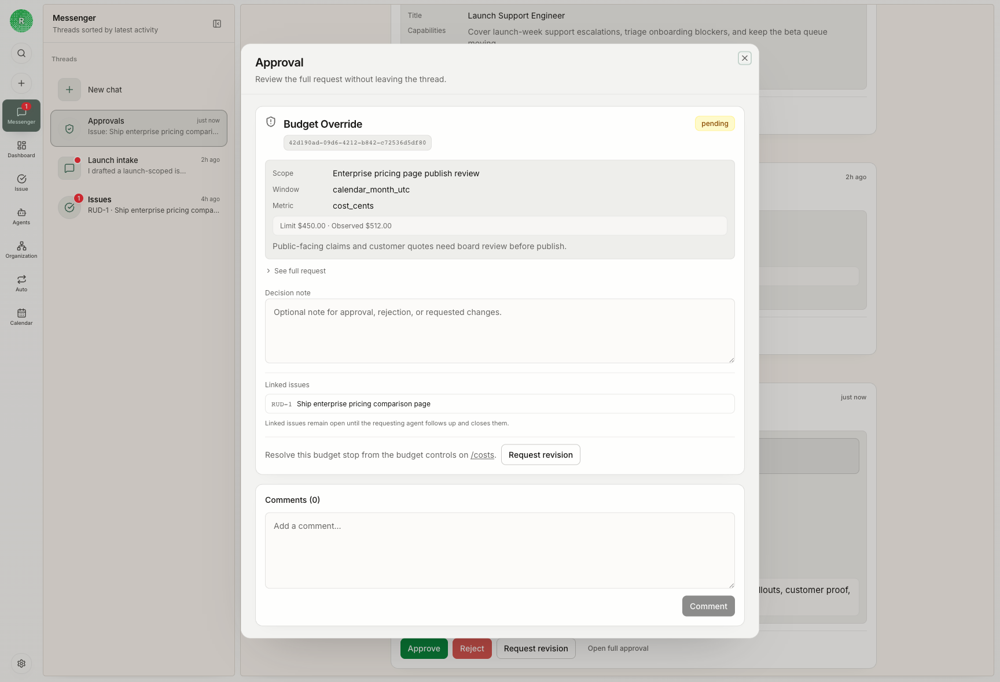

Messenger is Rudder's communication and attention surface. It brings chat conversations, issue threads, failed runs, blockers, review prompts, budget alerts, and decision requests into one place without replacing issues as the execution system.

## The job of Messenger

Messenger answers one operator question:

> What needs my attention right now, and which durable work object does it belong to?

Use it to move from attention back to action:

| Attention signal | Durable next step |
| --- | --- |
| Agent asks a question | Reply, then keep the decision on the issue |
| Run fails | Open the linked issue or run and decide recovery |
| Work is blocked | Name the missing input or owner |
| Review is waiting | Approve, request changes, or mark blocked |
| Chat proposes an issue | Accept, edit, or reject before execution |

## Messenger and Chat

Chat is one kind of Messenger thread. It is useful for conversational intake and clarification.

Messenger is broader. It includes the operational attention stream around issues, reviews, failures, and system prompts.

## Messenger and issues

Messenger should not become a second task tracker. If a thread produces real work, the next step should live on an issue:

- create a new issue
- update the existing issue status
- add a close-out comment
- attach the artifact
- assign a reviewer

This keeps agent work inspectable even after the conversation scrolls away.

## Messenger and decisions

Messenger can surface decisions, but the decision should leave a durable trace. For reviews, use reviewer decisions on the issue. For governed operations, use approvals. For product judgment or access requests, record the answer in the linked issue or thread.

## Good use cases

- A reviewer asks for changes and the assignee needs to resume.
- A failed run needs human triage before retrying.
- A budget stop needs an operator to decide whether to continue.
- A chat-created issue proposal needs human confirmation.
- A blocker needs a named owner and next action.

## Next steps

<CardGroup cols={2}>
  <Card title="Chat" icon="message-circle" href="/concepts/chat">
    Learn how conversational intake becomes work.
  </Card>
  <Card title="Issues" icon="circle-check" href="/concepts/issues">
    See the durable execution object Messenger points back to.
  </Card>
</CardGroup>
