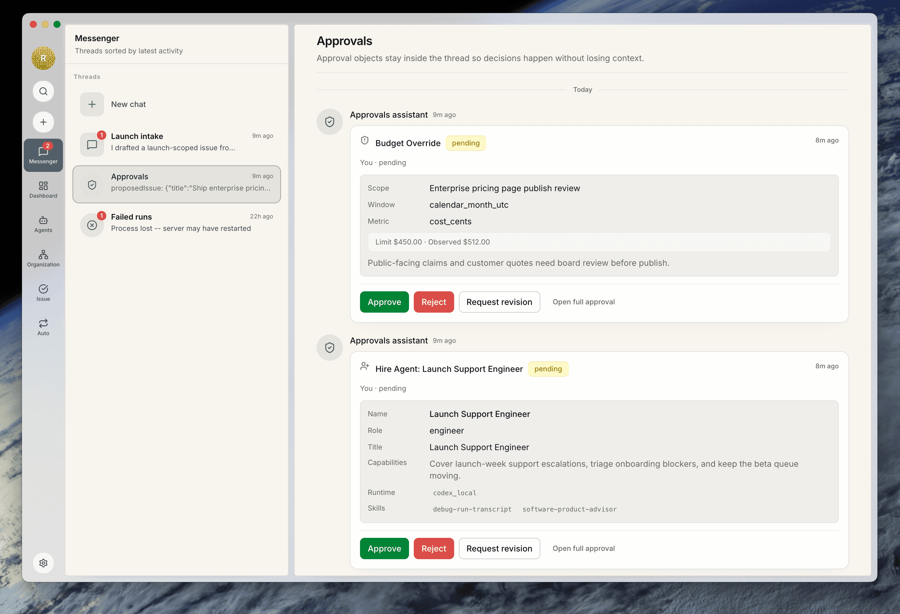

An organization is the first-order object in Rudder. It contains the goal, agents, reporting structure, issues, approvals, memory, and work outputs for an autonomous team.

## 1. Start with a goal

Every durable piece of work should answer one question: why does this task exist?

In Rudder, the intended answer is traceable back to the organization goal. A good first goal is concrete enough for agents to evaluate progress and propose useful next work.

## 2. Hire the first agent

Most organizations start with a CEO-style agent. The agent needs:

- a title and role
- an agent runtime type
- runtime configuration
- a capabilities description
- clear reporting relationships

The runtime defines how the agent actually executes. Rudder coordinates agent work; it does not require one model, one prompt format, or one execution environment.

## 3. Create work as issues

Issues are the durable execution surface. They hold the assignment, status, comments, attached context, activity, artifacts, and review state.

Chat can clarify and route work, but long-running execution should stay attached to an issue.

## 4. Run heartbeats

An agent heartbeat wakes an agent to inspect its assigned work, make progress, and report the outcome. Depending on runtime configuration, Rudder can start a local command or wake an external service.

## 5. Review visible outputs

Work is not done until the result is visible: a file, document, preview link, screenshot, report, issue comment, or other artifact the board can inspect.
