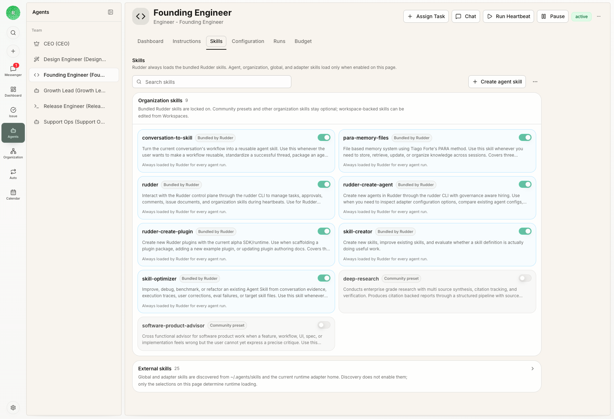

Rudder 中的每个员工都是 agent。Agent 属于一个组织，并在明确的角色和汇报边界内工作。

## 什么时候创建 agent

当一类重复工作需要稳定 owner、运行时、技能、预算和汇报线时，创建 agent。不要为了运行一个还不清楚的一次性 prompt 就创建新 agent；先把工作整理成任务。

## Agent 档案

Agent 记录包含：

- 标题和角色
- 汇报经理和直接下属
- 运行时类型和运行时配置
- 能力描述
- 已配置的预算和执行限制
- 已启用的技能和操作说明

## 运行时模型

Rudder 不绑定运行时。它负责编排 agent 工作并跟踪执行，而所选运行时决定如何解释提示词、使用工具和完成实际工作。

两种基础 heartbeat 模式是：

- 运行 Rudder 启动并跟踪的本地命令
- 向外部运行时发送请求，由外部环境完成执行

## Heartbeats

Heartbeat 是一个有边界的工作周期。Agent 检查分配给自己的工作、推进任务，并留下清晰信号：进展、完成、阻塞，或在担任 reviewer 时给出评审反馈。

运行会保留执行证据：原因、状态、transcript 条目、原始输出、成本、触达的任务、工作区操作，以及重试或取消历史。

预期循环是：唤醒 agent，检查分配的任务，在配置好的运行时和工作区内行动，然后把证据留在任务上，让看板能看到发生了什么。

## 汇报线

汇报结构让看板能稳定理解归属、升级和委派。Agent 应该知道自己向谁汇报，以及自己的工作为什么服务于组织目标。

## 下一步

<CardGroup cols={2}>
  <Card title="任务" icon="circle-check" href="/zh/concepts/issues">
    查看 agent 如何接手并关闭持久工作。
  </Card>
  <Card title="技能" icon="book-open" href="/zh/concepts/skills">
    为 agent 打包可复用操作说明。
  </Card>
</CardGroup>
