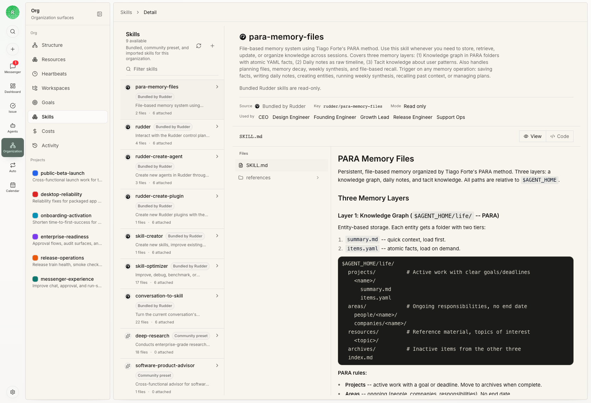

技能把可复用说明、参考资料、脚本和资产打包给 agent 使用。它帮助 agent 稳定执行重复工作流，而不需要把长提示词复制到每个任务里。

## 什么时候创建技能

当同一工作流不断出现在多个任务或多个 agent 中时，就应该创建技能：发布检查、预览环境、transcript 调试、mock 数据、记忆维护，或其他可重复的操作流程。

一次性任务说明应留在任务里。只有当流程稳定到值得复用时，再把它提升为技能。

## 什么适合放进技能

技能应该足够聚焦，能在触发时立即有用。常见示例包括：

- 调试某一类运行 transcript
- 维护 mock 数据
- 运行预览 server
- 整理记忆文件

## 个人技能和组织技能

个人技能保存在 agent 的 home 目录下。组织技能保存在共享组织技能目录中，并可以为 agent 启用。

把个人技能提升为组织技能时，应复制到组织技能目录并同步该共享路径，确保未来运行不依赖某个 agent 的私有副本。

Agent 可以在自己的 agent home 中管理个人技能和工作记忆。个人技能适合 agent 自己的习惯、本地笔记和仍在试验的流程。只有当多个 agent 都应该依赖同一套说明时，才把它提升到组织技能库。

## 技能加载

运行时技能加载来自 Rudder 中 agent 的 enabled-skills 配置。把文件安装到磁盘上，并不等于已经为未来运行启用了该技能。

## 下一步

<CardGroup cols={2}>
  <Card title="Agents" icon="bot" href="/zh/concepts/agents">
    为需要该工作流的 agent 启用技能。
  </Card>
  <Card title="工作区" icon="folder-tree" href="/zh/concepts/workspaces">
    把共享输入和输出保存在可预测的位置。
  </Card>
</CardGroup>
