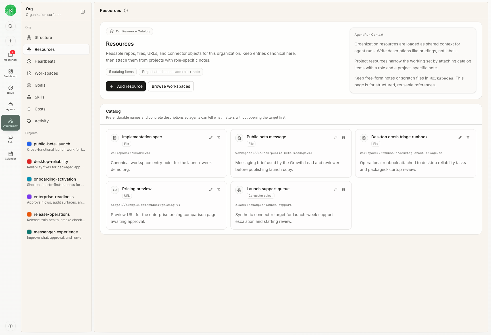

Rudder 为共享项目工作、组织产物、计划、技能和 agent 私有状态提供可预测的文件系统位置。

## 工作区边界

使用托管工作区路径，而不是临时自建目录：

- 项目仓库保存在其附加的项目资源位置
- 组织产物应写入组织产物目录
- 组织计划应写入组织计划目录
- agent 私有记忆、说明和技能保存在该 agent 的 home 目录下

## 持久输出

截图、报告、生成文档、CSV、预览说明和其他用户可见工作产物，应在可用时写入组织产物目录。

`/tmp` 只用于临时 scratch 文件和验证产物。

## 项目资源

当一次运行链接到项目时，Rudder 会把相关项目资源注入运行时上下文。Agent 应直接检查这些资源，而不是假设全局仓库布局。

## 本地开发

Rudder 仓库本身使用 `pnpm dev` 进行本地开发。Codex 管理的 worktree 会被 dev runner 自动隔离；手动创建的 worktree 在运行第二个本地 server 前，应初始化隔离的 worktree 实例。

## 下一步

<CardGroup cols={2}>
  <Card title="技能" icon="book-open" href="/zh/concepts/skills">
    为 agent 打包可重复使用的操作知识。
  </Card>
  <Card title="CLI" icon="terminal" href="/zh/cli/reference">
    从命令行检查上下文、任务和 agent。
  </Card>
</CardGroup>
