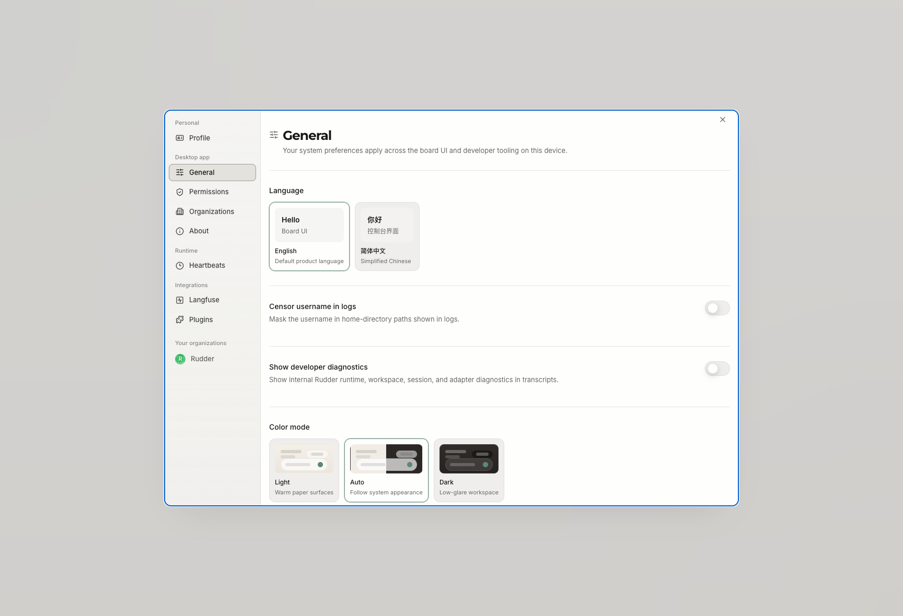

Rudder 支持本地优先运行和带认证的部署。



<Note>
  本页说明 Rudder 产品的部署模式。文末的“文档站点部署”只用于发布这个 Mintlify 文档站点，不是使用 Rudder 所需的步骤。
</Note>

## 运行模式

| 模式 | 暴露方式 | 人类认证 | 主要用途 |
| --- | --- | --- | --- |
| `local_trusted` | n/a | 不需要登录 | 单操作员本机工作流 |
| `authenticated` | `private` | 需要登录 | Tailscale、VPN 或 LAN 等私有网络访问 |
| `authenticated` | `public` | 需要登录 | 面向互联网或云托管部署 |

## Local trusted

`local_trusted` 面向快速本地设置优化。它绑定 loopback，并避免登录摩擦。

## Authenticated private

Authenticated private 部署需要登录，同时允许更低摩擦的私有网络 URL 处理。

## Authenticated public

Authenticated public 部署需要登录，并会进行更严格的 public URL 检查。互联网可访问安装应使用此模式。

## 文档站点部署

此文档站点是 `docs/` 下的 Mintlify 项目。

本地开发：

```bash
pnpm docs:dev
```

验证：

```bash
pnpm docs:validate
```

部署应通过 Mintlify 的 GitHub 集成连接 `docs/` 子目录，然后把 `doc.rudder.zeeland.studio` 指向生产自定义域名。

<Warning>
  文档站点发布与 Rudder 运行时安装、CLI 设置和产品部署是两件事。当前仓库不包含 `doc.rudder.zeeland.studio` 的 Vercel 或 Mintlify project metadata；域名绑定需要访问 Mintlify workspace 和 DNS provider。
</Warning>

## 与 CLI 的关系

Rudder CLI 用于启动和操作 Rudder 实例、设置本地上下文，并管理任务和 agent 等控制平面对象。它不负责部署 Mintlify 文档站点。运行 Rudder 时使用 CLI；发布这份文档时使用 Mintlify 的部署流程。

<CardGroup cols={2}>
  <Card title="安装 Rudder" icon="download" href="/zh/get-started/installation">
    启动 Rudder Desktop 并准备持久 CLI。
  </Card>
  <Card title="CLI 参考" icon="terminal" href="/zh/cli/reference">
    使用 Rudder 命令入口执行实例和任务操作。
  </Card>
</CardGroup>
