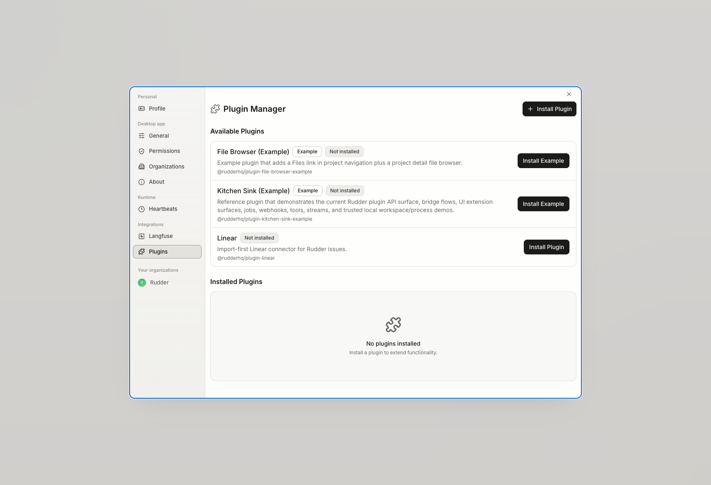

插件为 Rudder 添加自定义行为，而不必把每个边缘需求都放进核心产品。



## 当前 alpha 能力

插件 worker 和插件 UI 都是可信代码。当前实现支持 worker 侧 API：config、events、jobs、launchers、HTTP、secrets、activity、state、entities、projects、organizations、issues、agents、goals、data/actions、streams、tools、metrics 和 logging。

插件 UI 可以挂载到已配置的宿主表面，例如页面、设置页、dashboard widget、sidebar、详情 tab、toolbar button、context menu 和评论注解。

## 创建插件脚手架

先构建 scaffold package，再创建插件 package。

```bash
pnpm --filter @rudderhq/create-rudder-plugin build
node packages/plugins/create-rudder-plugin/dist/index.js @yourscope/plugin-name --output ./packages/plugins/examples
```

如果插件在 Rudder monorepo 外部，请提供绝对输出路径和 SDK 路径。

```bash
node packages/plugins/create-rudder-plugin/dist/index.js @yourscope/plugin-name \
  --output /absolute/path/to/plugin-repos \
  --sdk-path /absolute/path/to/rudder/packages/plugins/sdk
```

## 本地工作流

在生成的插件目录中运行：

```bash
pnpm install
pnpm typecheck
pnpm test
pnpm build
```

本地开发插件应通过绝对本地路径安装到 Rudder。生产环境优先发布到 npm 或私有 npm 兼容 registry。
